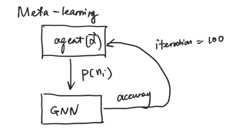

# Learn to Sample
Framework: Py Geometric: https://github.com/rusty1s/pytorch_geometric <br/>
Concept: GNN

Goal: Learn the sampling distribution used for node sampling in order to improve model accuracy. 

# Table of Contents
1. [Notation](#notation)
2. [Limitations of existing approaches](#limitations)
3. [Basic idea](#idea)
4. [Experimental settings](#experimental-settings)
5. [Approaches](#approaches)
6. [Code Setup](#setup)

## Notation: <div id="notation"/>
- P(n): Probability that a node n in Neighbors is sampled. For example: 
   - Neighborhood sampling use a uniform sampling distribution: p(n) = 1 / |Neighbors| 
   - Neighborhood sampling using importance smapling distribution p(n) = degree(n) / sum_degree(Neighbors)
   - Layerwise importance sampling: p(n) = degree(n) / sum_degree(all nodes)
- D: graph dataset
- GNN(X|W): the GNN model that takes X as inputs with parameters W. 
- Y: ground truth
- Loss(): loss function

## Limitations of existing approaches: <div id="limitations"/>
- The sampling distribution is manually designed
- The sampling distribution might not fit the graph in hand
- Most of the sampling approaches consider only one node degree information in sampling. However, it is not easy to generalize to heterogeneous graphs. 



## Basic idea:  <div id="idea"/>
- Apply meta-learning approaches(e.g. black-box optimization or Bayesian optimization) to learn a sampling function
    - Parameterized sampling function p(n|theta)
    - Optimization: 
        - W, Theta = arg min Loss(Y, GNN(X|W, p(n|theta)))
- The first one to purpose the learn to sample framework
- The design of different sampling function p(n)
    - p(n) = a * degree(n) + b * diversity(n) + c * other_metric(n)
    - Use manual designed features to get the other metrics:
    https://web.stanford.edu/class/cs224w/slides/02-tradition-ml.pdf 
        - node degree
        - node centrality
        - clustering coefficient
        - graphlets
- By directly fitting the sampling function to a task/graph, we could get a higher accuracy for the task.
- It is worthwhile to study whether the learned sampling function could easily transfer to similar tasks.
- Provide a programming framework to allow programmers to explore various customized sampling functions to learn (similar to nextdoor paper)

## Experimental settings: <div id="experimental-settings"/>
- Model: GCN
- Tasks: can start with small dataset Citeseer and then move to larger ones such as OGB
- Sampling strategies:
   - Node sampling (can start with this one)
   - Layerwise sampling
   - Graph sampling


## Approaches: <div id="approaches"/>
- Step 1: check what node properties could be incorporated in designing p(n). Can start with node sampling setting as existing frameworks already have the APIs to support node sampling. 
- Step 2: implement p(n|theta)
- Step 3: Use Bayesian optimization to learn theta. The optimization iterates two steps for many iterations (e.g. 100-1000)
   - Produce a new theta
   - Use the new theta to perform sampling and train the GNN to converge. 
   - Based on the accuracy/loss metric, provide feedback to update parameters in the meta learner. 
- Step 4: compare with baselines
   - Node sampling with uniform sampling
   - Node sampling with importance sampling
   - Maybe some others?

## Code Setup: <div name="setup"/>
Create Conda environment using:
```
conda create -n learn_to_sample python=3.6
```
install required packages using requirements.txt
```
pip3 install -r ./requirements.txt
```